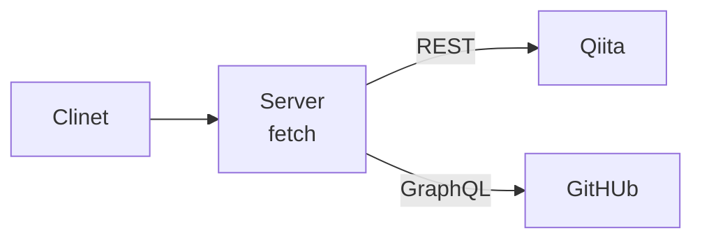

このメモは、Remix で Web 標準 API で GraphQL Query 処理を実装した時にまとめたものです。

Apollo Client などの Client Side の操作ではなく、Server Side で操作します。



Topic は以下のとおりです。
- Remix
- TypeScript
- GraphQL
- Cloudflare Pages

さらに詳しく見たい方は読み続けてください。

---

2023年9月3回目です。


Remix は、Server Side も Web 標準の Web Fetch API で実装することを目指しています。

Apollo Client[^5] などを使わず、標準 API（Fetch）で通信する方法で実装します。

[^5]: https://www.apollographql.com/docs/react/

# GraphQL Server
- Endpoint は、GitHub の GrahpQL を使います。
- Endpoint URI と Token を環境変数に定義します。
   - Local 環境
      - environmetは `.dev.vars` に定義します。[^4]
         - Remix を Cloudflare に Hosting する場合。
   - Cloudflare Pages
      - Settings > Environment variables[^3]

[^3]: https://developers.cloudflare.com/pages/platform/build-configuration/#environment-variables

[^4]: https://remix.run/docs/en/1.19.3/guides/envvars#server-environment-variables

# GitHub GraphQL API[^2]
- `User-Agent` が必要です。
- Requirement
   - Header
      - User-Agent
      - Authorization
         - Personal Access Token[^1]

[^1]: https://docs.github.com/ja/authentication/keeping-your-account-and-data-secure/managing-your-personal-access-tokens

[^2]: https://docs.github.com/ja/graphql

- User-Agent がない場合。
```bash
SyntaxError: Unexpected token 'R', "
Request fo"... is not valid JSON
    at async getRepositories (cc79nj3l2mn.js:16068:11)
    at async loader (cc79nj3l2mn.js:16141:168)
    at async callRouteLoaderRR (cc79nj3l2mn.js:3329:16)
    at async callLoaderOrAction (cc79nj3l2mn.js:2434:16)
    at async Promise.all (index 0)
    at async loadRouteData (cc79nj3l2mn.js:2168:19)
    at async queryImpl (cc79nj3l2mn.js:2048:20)
    at async Object.query (cc79nj3l2mn.js:2000:18)
    at async handleDocumentRequestRR (cc79nj3l2mn.js:3480:15)
    at async cc79nj3l2mn.js:3599:228 {
  stack: SyntaxError: Unexpected token 'R', "
Request fo".….js:3480:15)
    at async cc79nj3l2mn.js:3599:228,
  message: Unexpected token 'R', "
Request fo"... is not valid JSON
```

## Summary
- Web 標準 API で GraphQL Query 処理についてまとめました。
